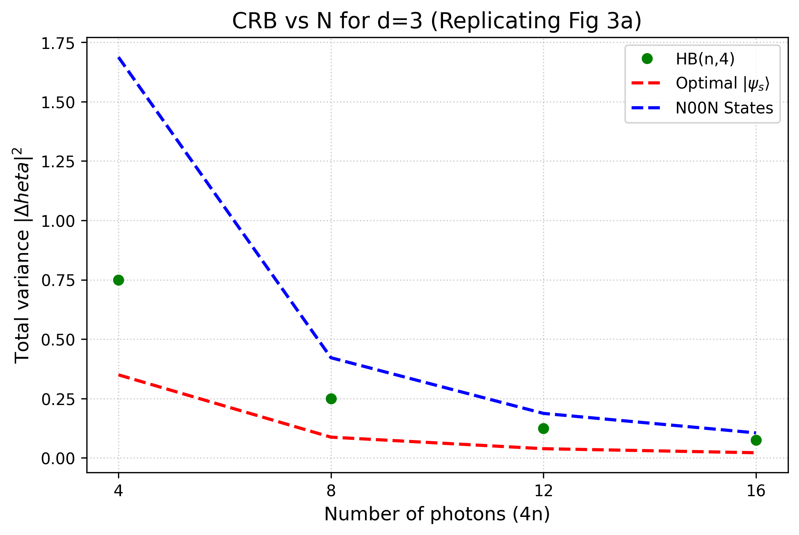
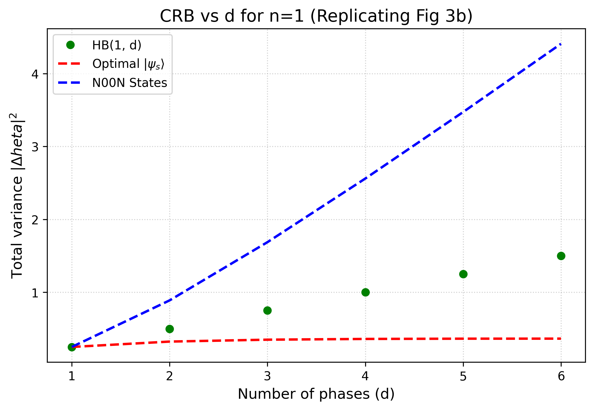
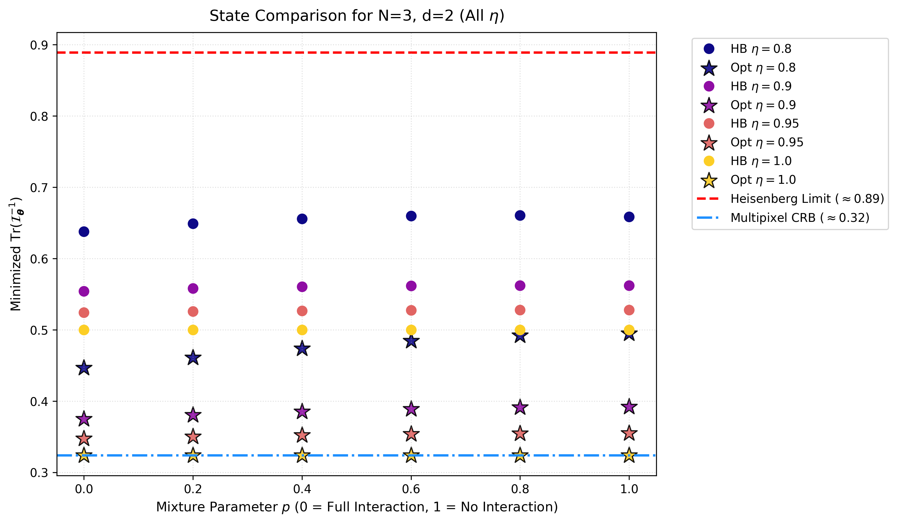
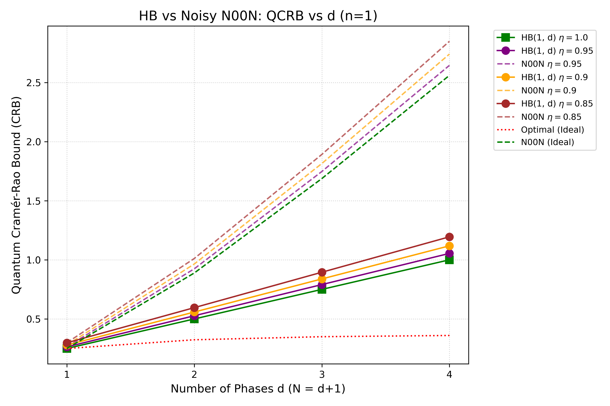
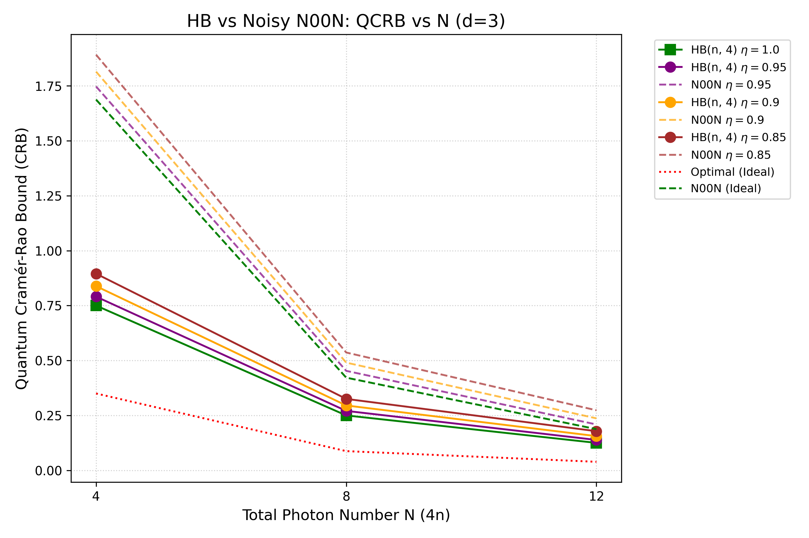
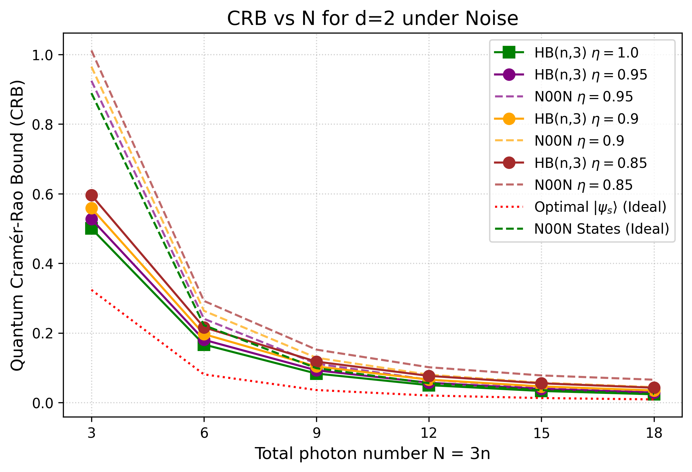
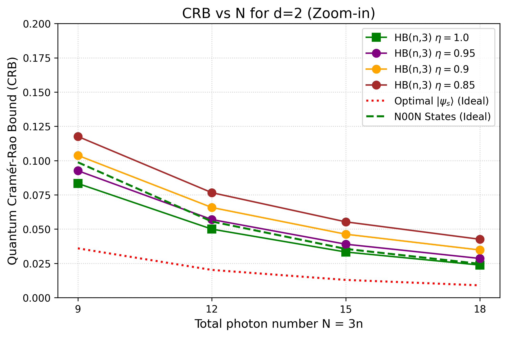

# Project B: Comprehensive Theoretical Framework & Final Documentation
**Quantum Enhanced Electron Microscopy via Multipixel Phase Estimation**

This document serves as the complete theoretical foundation for Project B. It chronologically details the physical and mathematical concepts utilized, transitioning from standard single-parameter limits to advanced multi-parameter quantum metrology under noisy environments.

---

## Table of Contents
1. **[Chapter 1: The Metrology Framework](#chapter-1-the-metrology-framework)**
2. **[Chapter 2: State Definitions & Mathematical Initialization](#chapter-2-state-definitions--mathematical-initialization)**
3. **[Chapter 3: Modeling Decoherence](#chapter-3-modeling-decoherence)**
4. **[Chapter 4: Evaluation Metrics (QFIM and QCRB)](#chapter-4-evaluation-metrics-qfim-and-qcrb)**
5. **[Chapter 5: Final Plots & Empirical Captions](#chapter-5-final-plots--empirical-captions)**

---

## Chapter 1: The Metrology Framework

### 1.1 Computational Goals in Quantum Metrology
While the broader research context of this work relates to reducing irreversible damage in electron microscopy via quantum-enhanced metrology, the specific theoretical and computational focus of this project is the rigorous numerical modeling of multi-parameter phase estimation under noise. 

According to classical estimation theory, the precision of estimating $d$ unknown phases using $N$ independent, unentangled probe particles is bounded by the **Standard Quantum Limit (SQL)**, where the variance scales as $\mathcal{O}(1/N)$. Utilizing quantum entanglement, the theoretical physical limit—the **Heisenberg Limit (HL)**—bounds the variance tightly at $\mathcal{O}(1/N^2)$.

### 1.2 The Multipixel Advantage
Real-world microscopy is inherently a multiparameter problem; an image consists of distinct spatial pixels that must be estimated. Humphreys et al. (2013) demonstrated that simultaneously estimating $d$ phases using a globally entangled quantum probe can yield a variance scaling as $\mathcal{O}(d/N^2)$. This offers a distinct, fundamental advantage over $d$ independent sequential single-phase measurements, which are strictly bounded by $\mathcal{O}(d^2/N^2)$.

---

## Chapter 2: State Definitions & Mathematical Initialization

To achieve the Heisenberg limit in a multi-parameter environment, the choice of the quantum state is critical.

### 2.1 The N00N State Benchmark
The N00N state achieves the Heisenberg limit in perfectly ideal, noiseless conditions. It is characterized by all $N$ particles passing through a single mode in superposition with all particles passing through the reference mode. However, N00N states are exceptionally fragile; the loss of a single particle collapses the global phase coherence, reducing the state to a statistical mixture.

### 2.2 Holland-Burnett (HB) States via Multi-Port QFT
To find a realistic, deployable alternative, we utilized Holland-Burnett (HB) states. The original HB state was proposed in 1993 for 2-mode (single phase) interferometry by injecting two identical Fock states into a 50:50 beam splitter. 

For our multi-parameter scenario ($d$ phases $\implies d+1$ total modes), we generalized this via a symmetric unitary rotation known as the **Multi-Port Quantum Fourier Transform (QFT)**.

**Mathematical Construction:**
1. **Mode Allocation**: For $N$ photons and $m = d+1$ modes, we allocate an identical number of photons into each input port: $n = N/m$.
2. **The Beam-Splitter Network**: We define the phase factor $\omega = \exp(2\pi i / m)$. The mixed-mode creation operators $b_k^\dagger$ are superpositions of the independent mode operators $a_j^\dagger$:
   $$ b_k^\dagger = \frac{1}{\sqrt{m}} \sum_{j=0}^{m-1} \omega^{j \cdot k} \hat{a}_j^\dagger $$
3. **The Final HB State**:
   $$ |\psi_{HB}\rangle = \mathcal{N} \prod_{k=0}^{m-1} (b_k^\dagger)^n |0\rangle^{\otimes m} $$

These states are known to be far more resilient to noise while maintaining near-optimal multi-phase sensitivity.

---

## Chapter 3: Modeling Decoherence

A primary technical hurdle in establishing realistic bounds is the computational cost of simulating decoherence.

### 3.1 The Shift from Stinespring to Kraus Formalism
In earlier project iterations, noise was modeled using **Stinespring dilation**, introducing an environmental "loss mode" for every physical mode. This doubled the Hilbert space dimensionality and caused exponential memory blowups, rendering calculations beyond $N=6$ impossible on standard hardware.

To overcome this, we transitioned exclusively to the **Kraus Operator Formalism**.

### 3.2 Independent Particle Loss
We model localized electron scattering as an amplitude damping channel with a transmission probability $\eta$ (where $\eta=1$ is ideal). We lock the interaction parameter to $p=1$, modeling strictly independent loss across all $d$ signal modes (the reference mode remains lossless). 

The truncated single-mode Kraus operators up to dimension $D$ are:
$$ E_k = \sum_{n=k}^{D-1} \sqrt{\binom{n}{k}} \, \eta^{(n-k)/2} \, (1-\eta)^{k/2} \, |n-k\rangle\langle n| $$
The final noisy output state is the sequential application of these operators:
$$ \rho_{\text{out}} = \prod_{j=1}^{d} \sum_{k=0}^{D-1} E_k^{(j)} \rho_{\text{pure}} \, E_k^{(j)\dagger} $$
By mapping this explicitly over Gram matrices instead of full density matrices, we successfully extended our evaluation range up to $N=18$.

---

## Chapter 4: Evaluation Metrics (QFIM and QCRB)

To evaluate the resolution limit of our noisy state $\rho_{\text{out}}$, we compute the **Quantum Fisher Information Matrix (QFIM)**.

### 4.1 Spectral Decomposition Derivative
The Symmetric Logarithmic Derivative (SLD) governs the matrix geometry necessary to derive the precision boundaries. We resolve $\rho_{\text{out}}$ into its spectral eigenbasis: $\rho_{\text{out}} = \sum_k \lambda_k |k\rangle\langle k|$. 

The partial derivative mapping for the generator $\hat{n}_\mu$ evaluates to:
$$ \langle k | \partial_\mu \rho | m \rangle = -i(\lambda_m - \lambda_k)\langle k | \hat{n}_\mu | m \rangle $$

### 4.2 The Quantum Cramér-Rao Bound (QCRB)
The elements of the QFIM are compiled as:
$$ F_{\mu\nu} = \operatorname{Re}\left( \sum_{\lambda_m + \lambda_k > 0} \frac{2}{\lambda_n + \lambda_m} \langle k| \partial_\mu \rho |m\rangle \langle m| \partial_\nu \rho | k\rangle \right) $$
The ultimate variance bound (QCRB) across all independent phases is extracted as the trace of the inverse QFIM:
$$ \text{Total Variance } \Delta^2 (\hat{\boldsymbol{\theta}}) = \operatorname{Tr}\left(F^{-1}\right) $$

### 4.3 Analytical Noisy N00N Benchmark
To physically benchmark our HB numerical results, we utilized an analytical formula derived for the total variance of a generalized noisy N00N state under identical asymmetric loss:
$$ V_{N00N}(\eta, N, d) = \frac{d^3 (1 + \eta^{N/d})}{2 N^2 \eta^{N/d}} $$

---

## Chapter 5: Final Plots & Empirical Captions

Below are the 7 final plots utilized in the Project B report, visually summarizing the theoretical math detailed above.

### 5.1 Baseline Verification (The Ideal Case)

**Caption:** *Quantum Cramér-Rao Bound (CRB) vs. Total number of photons ($N$) for the noiseless case ($\eta=1$). The HB state clearly scales with the Optimal limit, validating the baseline model against the Humphreys framework.*

 

**Caption:** *Quantum Cramér-Rao Bound (CRB) vs. Number of estimated phases ($d$) for the noiseless case ($\eta=1$). The independent axis separation confirms that HB states scale linearly with $d$, vastly outperforming the sequential N00N strategy.*

 

### 5.2 The Interaction Parameter ($p$) and High Transmission Behavior

**Caption:** *QCRB Comparison of HB states vs. Optimized states across varying interaction parameters ($p \in [0.0, 1.0]$) for $N=3, d=2$. Notably, at highly ideal transmission values ($\eta=0.95$ and $\eta=1.0$), the resultant variance is physically independent of the shared interaction parameter $p$.*

 

### 5.3 Multipixel Scaling vs. Number of Phases under Noise

**Caption:** *Quantum Cramér-Rao Bound (CRB) vs. Number of Phases ($d$) holding photon count per mode constant ($n=1$). Solid lines represent HB states; dashed lines of the same color represent Noisy N00N states for the corresponding $\eta$. HB states scale linearly and maintain their quantum advantage across all phases, whereas N00N states degrade drastically.*

 

### 5.4 The "Crossover Point" in Photon Number Scaling

**Caption:** *Quantum Cramér-Rao Bound (CRB) vs. Total Photon Number ($N$) for $d=3$. Solid lines represent HB states; Dashed lines represent N00N states. The exponential failure of N00N states is highly visible due to the explicit $\eta^{-N/d}$ denominator in its variance equation, while HB states maintain significantly higher relative precision.*

 

**Caption:** *Quantum Cramér-Rao Bound (CRB) vs. Total Photon Number ($N$) for $d=2$ across various noise levels $\eta$. This wide-angle metric provides a broader context before focusing on the critical intersection limits.*

 

**Caption:** *Zoomed-in Quantum Cramér-Rao Bound (CRB) vs. Photon Number ($N$) for $d=2$. This plot explicitly highlights the physical "crossover point" at lower $N$ values where the variance lines of HB and N00N states intersect under specific transmission parameters. Beyond this scaling threshold, cumulative noise overcomes the entanglement advantage.*

